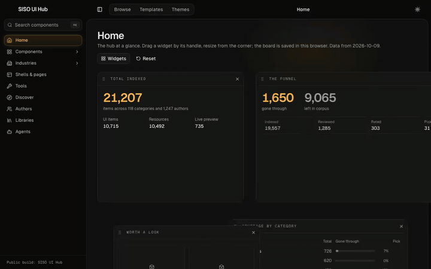

<!-- siso-os:header (generated by sisodias/siso-os-release from repos.json; edit there, not here) -->
<p align="center">
  <a href="https://www.sisolabs.space/swipe-file/"></a>
</p>
<h1 align="center">SISO Shell</h1>
<p align="center"><b>A bank of HTML page templates an agent composes reports, plans and one-pagers from.</b></p>
<p align="center">
  <a href="https://www.sisolabs.space/swipe-file/"></a>
  <a href="https://github.com/siso-os/siso-shell/blob/HEAD/LICENSE"></a>
  <a href="https://github.com/siso-os"></a>
  <a href="https://github.com/siso-os/siso-shell/stargazers"></a>
</p>
<p align="center">
  <a href="https://www.sisolabs.space/swipe-file/"></a>
</p>
<p align="center">
  <a href="https://www.sisolabs.space/swipe-file/"><b>Website</b></a> · <a href="https://docs.sisolabs.space">Docs</a> · <a href="https://github.com/siso-os">Every SISO OS project</a>
</p>

<!-- /siso-os:header -->

The SISO CRM GroupedRail as a static shell, the twelve page modules it frames, and one template per page family the Great Library and every SISO front door composes. No framework; `node` is the only build step. Published bank: https://siso-shell.pages.dev/ (the gallery is the front page; `/t/<id>/` is each family's spec; `/t/<id>/example/` its rendered example; `/how/` the reuse guide).

```
shell/        tokens.css (SISO CRM tokens, verbatim) · rail.css (GroupedRail.css verbatim + token-only static additions) · rail.js · icons.mjs (lucide, ISC)
shell.mjs     rail({title, mark, home, groups, current, page}) → <nav class="siso-sidebar"> · head(base) → <link>/<script>
parts/        the twelve modules (library-ui-spec §6) + atoms, one HTML partial each · parts.css · catalogue.js
templates/    one folder per family U0…U23: template.html · schema.json · example.json (real data) · README.md (generated from plan/templates.json)
bin/compose   compose <family> <data.json> [--nav nav.json] [--base URL] [--current href] [--out page.html]
bin/build-site  renders site/ (gallery, 24 detail pages, examples, /how/, 404, shell/, parts/)
site/         what siso-shell.pages.dev serves; nav.json is the bank's own site map, templates.json the plan
```

Use it: `bin/compose U4 templates/U4/example.json --out page.html`, or link the shell by URL (`head("https://siso-shell.pages.dev/shell")`) and paste a `<nav class="siso-sidebar">` with your groups. `node --test` runs the engine, shell and compose tests.

Rules: the rail is copied from the CRM, never adapted (every value resolves through the CRM token names; sources hashed in `shell/rail.css`); groups are headings and never fold, only "On this page" does; example data is real or the part shows a truthful empty state; his words are verbatim or absent; presentation robbed from the Action Model sites and 21st.dev picks carries its receipt; lucide icons are ISC (notice in `shell/icons.mjs`).

Legacy: `assets/shell.{css,js}` and the flat 0.1.0 `rail()` signature are kept for the Great Library's pinned import until it re-pins. Original static implementation from the owner's SISO CRM interaction brief; no client code, data or private operational identifiers are included. No general redistribution licence is asserted.